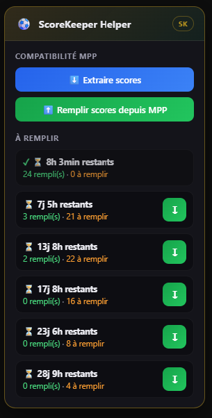

# ScoreKeeper Helper

Assistant Chrome pour **[scorekeepers.uk](https://scorekeepers.uk/)** : une card en haut
à droite qui regroupe des outils pratiques pour gérer ses pronostics, avec en plus une
passerelle vers [mpp.football](https://mpp.football/).

L'objectif est d'être un **helper général de ScoreKeeper** — la compatibilité MPP n'est
qu'une fonctionnalité parmi d'autres, et la base est pensée pour en accueillir de nouvelles.

| Côté Scorekeepr | Côté MPP |
|---|---|
|  |  |

## Fonctionnalités

**Sur scorekeepers.uk :**

- **Suivi « À remplir »** — les matchs sont regroupés par journée (countdown identique) ;
  pour chacune, le nombre de paris remplis / restants, et un bouton ↧ qui défile jusqu'au
  premier match à remplir (avant l'échéance).
- **Compatibilité MPP** — *Extraire scores* (produit un JSON, copié automatiquement) et
  *Remplir scores depuis MPP* (colle un JSON, remplit **et valide** chaque pari).
- Si l'on n'est pas sur la page des pronos, un bouton **« Aller sur la page des pronos »**
  y mène directement.

**Sur mpp.football :**

- *Extraire scores* / *Remplir scores depuis Scorekeeper* pour faire le pont dans l'autre sens.

Les noms d'équipes sont reliés FR ↔ EN via un dictionnaire (`teams.js`) tolérant aux
accents, lettres doublées, espaces/tirets et petites fautes. Le remplissage produit un
rapport : *remplis*, *modifiés*, *déjà remplis*, *non trouvés*.

## Installation

1. Ouvrir `chrome://extensions/`
2. Activer le **Mode développeur** (en haut à droite).
3. **Charger l'extension non empaquetée** → sélectionner ce dossier.
4. Aller sur scorekeepers.uk (ou mpp.football) : la card apparaît en haut à droite.

## Fichiers

| Fichier | Rôle |
|---|---|
| `manifest.json` | Déclaration de l'extension (Manifest V3). |
| `teams.js` | Dictionnaire FR↔EN + rapprochement tolérant des noms. |
| `content.js` | UI flottante et fonctionnalités (suivi, extraction, remplissage). |

Pour ajouter une équipe manquante, éditer le tableau `TEAM_GROUPS` dans `teams.js`.
